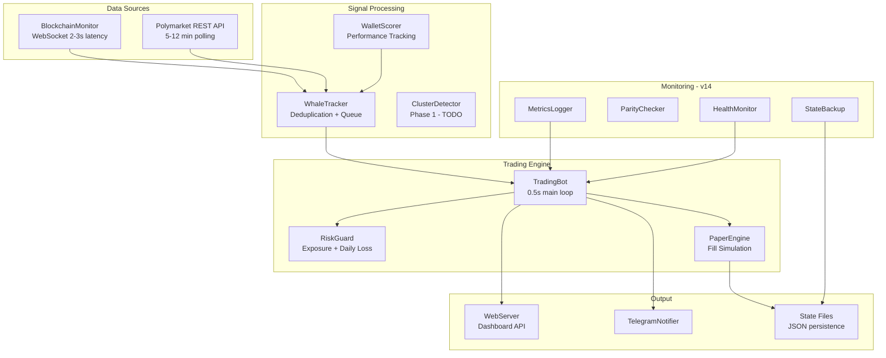

# GLM-5 Continuation Plan — Polymarket Bot 2026 Pack

**Created**: February 12, 2026
**Previous LLM**: Claude Sonnet 4.5
**Current LLM**: GLM-5
**Status**: Ready to continue Phase 0 implementation

---

## 📊 Executive Summary

### Project Overview
A production-ready Polymarket CLOB trading bot (Python 3.9.6) that combines:
- **Whale copy trading** (current focus, needs optimization)
- **Real-time blockchain monitoring** (v12+, 2-3 second latency)
- **Comprehensive paper trading simulation** (13-layer friction model)
- **Locked-profit arbitrage** (disabled - negative EV per LLM audits)

### Current Performance
```
Starting Balance:     $100.00
Current Balance:      $82.10
Total P&L:            -$17.90 (-17.9%)
Win Rate:             0% (0 wins, 6 losses)
Total Trades:         15
```

### Root Cause of Poor Performance
The **Copy Trading Latency Tax**:
1. Whale buys @ $0.428
2. Price jumps to $0.455 (HFT bots front-run, 6.3% slippage)
3. Bot sees signal 2-3s later
4. We execute @ $0.458 (additional 0.7% slippage)
5. Fees: 2% curved fee = $0.009
6. **Effective entry penalty: 7-9% above whale entry**

### Strategic Pivot
**From**: Pure execution copying (always late to trades)
**To**: Logic extraction (predict whale decisions before execution)

---

## 🏗️ Architecture Overview

### File Structure
```
Polymarket_Bot_2026_Pack/
├── run.py                    # Entry point
├── config/config.json        # User configuration (v14)
├── src/
│   ├── bot.py               # Main orchestrator (0.5s loop)
│   ├── whale_tracker.py     # Signal generation
│   ├── paper_engine.py      # Trade execution
│   ├── blockchain_monitor.py # Real-time Polygon monitoring
│   ├── market.py            # Market data service
│   ├── risk.py              # Risk management
│   ├── wallet_scorer.py     # Wallet performance tracking
│   ├── metrics_logger.py    # v14 structured logging
│   ├── parity_checker.py    # v14 blockchain validation
│   ├── health_monitor.py    # v14 health checks
│   └── web_server.py        # Dashboard API
└── static/index.html        # Dashboard frontend
```

### Data Flow
```
BlockchainMonitor (WebSocket, 2-3s latency)
        ↓
WhaleTracker (signal deduplication + queue)
        ↓
TradingBot.main_loop (0.5s cycle)
        ↓
PaperEngine (simulate fills + fees)
        ↓
State files (paper_state.json, whale_state.json)
```

### Thread Architecture
- **Main Thread**: 0.5s trading loop
- **BlockchainMonitor**: WebSocket listener (daemon)
- **HealthMonitor**: Health checks every 30s (daemon)
- **MetricsLogger**: Flush every 60s (daemon)
- **WebServer**: HTTP API + dashboard (non-daemon)

---

## ✅ What's Working (v14)

### Production Monitoring Systems
1. **MetricsLogger** - CSV/JSON structured logging
2. **ParityChecker** - Blockchain validation reports
3. **HealthMonitor** - Auto-recovery on failures
4. **StateBackup** - 5-generation backup rotation
5. **Fee Classification** - Crypto 10%, sports 0%, fallback 2%
6. **Signal Deduplication** - MD5 fingerprinting, 30-min TTL

### Blockchain Monitoring (v12-v13)
- 2-3 second latency via Polygon WebSocket
- All 8 critical bugs fixed (4 LLM audit consensus)
- Network discovery of profitable wallets ($500+ trades)
- Gas signals for position sizing

---

## ❌ Current Problems

### CRITICAL (Phase 0)

#### 1. WebSocket Leak in Dashboard
- **File**: [`src/web_server.py:260`](src/web_server.py:260)
- **Problem**: `monitor.web3.is_connected()` creates new WebSocket on every poll (2s interval)
- **Impact**: Alchemy 100-connection limit exceeded after ~19 hours
- **Fix**: Replace with boolean flag `monitor.connected`
- **ETA**: 10 minutes

#### 2. Missing Resolution Times on Dashboard
- **Files**: [`static/index.html`](static/index.html), [`src/web_server.py`](src/web_server.py)
- **Problem**: Users can't see when positions resolve/expire
- **Fix**: Parse `end_date_iso` from market metadata, add column
- **ETA**: 2-3 hours

### HIGH (Phase 1)

#### 3. 0% Win Rate
- **Root Cause**: 7% latency tax from copy trading
- **Fix**: CLOB WebSocket (300ms) + selective execution + logic extraction

#### 4. Kelly Criterion Not Applied
- **Files**: [`src/bot.py`](src/bot.py), [`src/paper_engine.py`](src/paper_engine.py)
- **Problem**: Fixed `COPY_TRADE_SIZE` instead of Kelly-based sizing
- **Fix**: Wire Kelly sizing into copy trade execution

#### 5. Wrong Whales Copied
- **Problem**: Copying ALL 775 signals indiscriminately
- **Fix**: Selective execution filter (confidence > 0.6)

---

## 📋 Implementation Roadmap

### Phase 0: Immediate Fixes (Days 1-2)
**Goal**: Fix critical bugs preventing effective paper trading

| Task ID | Task | Priority | Status |
|---------|------|----------|--------|
| POLY-001 | Fix WebSocket leak in dashboard | CRITICAL | TODO |
| POLY-002 | Add resolution times to dashboard | HIGH | TODO |

### Phase 1: Quick Wins (Days 3-7)
**Goal**: Increase win rate from 0% to 20-35%

| Task ID | Task | Priority | Status |
|---------|------|----------|--------|
| POLY-101 | Implement CLOB WebSocket (300ms latency) | HIGH | TODO |
| POLY-102 | Selective execution filter (confidence > 0.6) | HIGH | TODO |
| POLY-103 | Whale clustering detection (3+ whales) | HIGH | TODO |
| POLY-104 | Apply Kelly Criterion to copy trades | MEDIUM | TODO |

### Phase 2: Transformational Change (Weeks 2-6)
**Goal**: Extract whale decision patterns, achieve 40-60% win rate

| Task ID | Task | Priority | Status |
|---------|------|----------|--------|
| POLY-201 | Whale profiler (statistical playbooks) | HIGH | TODO |
| POLY-202 | LLM pattern extraction (Claude API) | MEDIUM | TODO |
| POLY-203 | Multi-LLM consensus | FUTURE | TODO |

### Phase 3: Advanced Features (Optional)
- QuantVPS deployment (after $60+/month profitability)
- Bregman optimization (if scaling to $10k+ capital)

---

## 🔧 Technical Details for Phase 0

### Task POLY-001: Fix WebSocket Leak

**Current Code** ([`src/web_server.py:260`](src/web_server.py:260)):
```python
"connected": monitor.web3.is_connected() if hasattr(monitor, 'web3') else False
```

**Fix**:
1. Add `self.connected = False` flag to [`BlockchainMonitor.__init__()`](src/blockchain_monitor.py)
2. Set `self.connected = True` when WebSocket connects
3. Set `self.connected = False` on disconnect/stop
4. Change web_server.py to use `monitor.connected`

### Task POLY-002: Add Resolution Times

**Changes Required**:
1. [`src/web_server.py`](src/web_server.py) - Fetch `end_date_iso` from market metadata
2. [`static/index.html`](static/index.html) - Add "Resolves At" column to positions table
3. Sort positions by soonest expiry
4. Highlight positions expiring in <24 hours

---

## 📐 System Architecture Diagram



---

## 🎯 Recommended Next Steps

### Immediate (Today)
1. **Fix WebSocket leak** (POLY-001) - 10 minute fix
2. **Add resolution times** (POLY-002) - 2-3 hour fix

### This Week
3. **Implement selective execution** (POLY-102) - Filter low-confidence signals
4. **Apply Kelly Criterion** (POLY-104) - Wire into copy trading

### Next 2 Weeks
5. **CLOB WebSocket** (POLY-101) - Research API, implement 300ms latency
6. **Whale clustering** (POLY-103) - Detect convergence trades

---

## 📝 Key Principles for Continuation

1. **Never remove RiskGuard** - User safety first
2. **Never skip state backups** - Always use `save_state_with_backup()`
3. **Never commit secrets** - `config/config.json` stays local
4. **Never reorganize file structure** - Per CLAUDE_HANDOFF.md constraint
5. **Always update CLAUDE_HANDOFF.md** - Rolling documentation is critical

---

## 🔄 Handoff Protocol

When switching LLMs or ending a session:
1. Update `CLAUDE_HANDOFF.md` with changes made
2. Update `TODO_IMPLEMENTATION.md` with task status
3. Document any new issues discovered
4. Note any decisions made and rationale

---

**Ready to proceed with Phase 0 implementation.**
