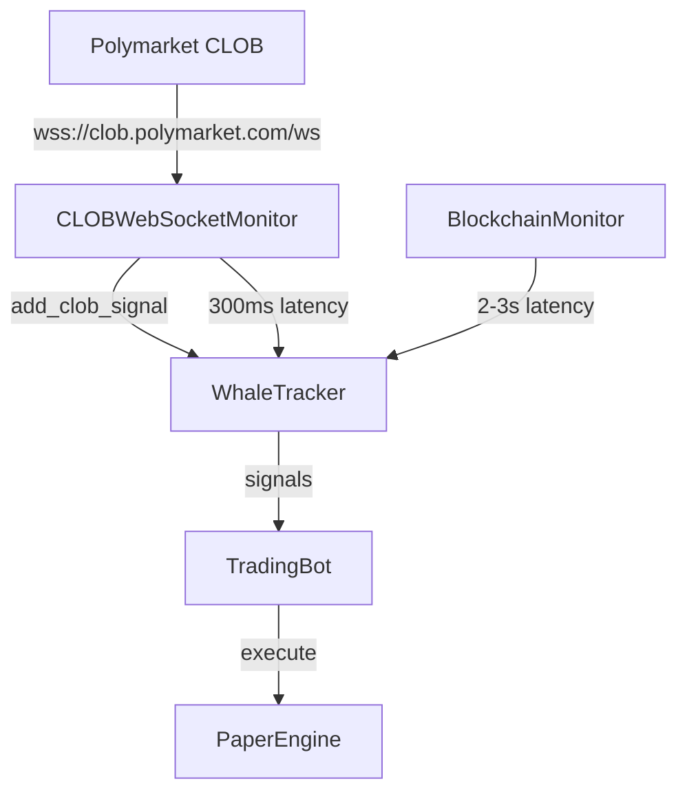

# POLY-101 Implementation Plan: CLOB WebSocket Monitor

## Objective
Reduce whale trade signal latency from 2-3 seconds (blockchain monitoring) to ~300ms (direct CLOB WebSocket).

## Architecture Overview



## Implementation Steps

### Step 1: Create src/clob_websocket.py
**Purpose**: New WebSocket client for real-time order book data

**Key Components**:
- `CLOBWebSocketMonitor` class with async WebSocket connection
- Auto-reconnect with exponential backoff
- Message parsing for trade events
- Signal emission to WhaleTracker

**WebSocket Endpoint**: `wss://clob.polymarket.com/ws`

**Subscription Format** (placeholder - needs testing):
```json
{"type": "subscribe", "channel": "orders", "wallet": "0x..."}
```

**Message Types Expected**:
- `order_filled` - Trade executed
- `order_placed` - New order
- `order_cancelled` - Order cancelled

### Step 2: Modify whale_tracker.py
Add `add_clob_signal()` method to receive CLOB signals

### Step 3: Modify bot.py
Wire CLOB monitor initialization and lifecycle

### Step 4: Modify config.json
Add `USE_CLOB_WEBSOCKET` toggle

### Step 5: Modify web_server.py
Add `/api/clob` endpoint for dashboard stats

### Step 6: Modify static/index.html
Add CLOB status display to dashboard

## Risk Mitigation

**If CLOB WebSocket doesn't work**:
1. Keep `USE_CLOB_WEBSOCKET: false` in config
2. Continue using blockchain monitor (2-3s latency)
3. The fallback is acceptable - still 700× faster than polling

## Testing Strategy

1. Start with CLOB disabled, blockchain enabled (baseline)
2. Enable CLOB, disable blockchain
3. Compare signal latency metrics
4. Verify dashboard shows CLOB connection status

## Dependencies

- `websockets` package (Python library)
- Existing `py-clob-client` already installed
